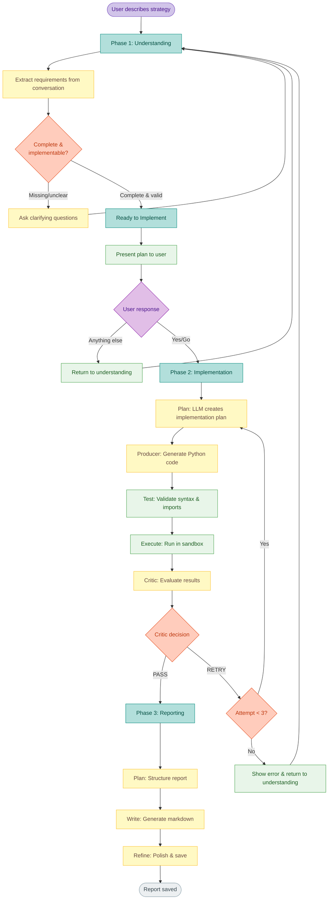

# NLBT — Natural Language Backtesting

> **Turn plain English into professional backtesting reports in minutes.**  
> Describe your trading strategy in natural language. Get Python code, backtest results, and professional reports. No coding required.

---

## 🚀 Quick Start

```bash
# 1. Install
git clone https://github.com/yourusername/nlbt && cd nlbt
pip install -e .

# 2. Configure LLM
llm keys set openrouter
llm models default openrouter/anthropic/claude-3.5-sonnet

# 3. Run
nlbt
```

**Try it**: Type `"Buy and hold AAPL in 2024 with $10,000"` and press enter.

---

## ✨ Key Benefits

| Feature | Benefit |
|---------|---------|
| 💬 **Natural Language** | Describe strategies in plain English - no coding needed |
| 🤖 **AI-Powered** | Uses Claude 3.5 Sonnet for robust code generation |
| ⚡ **Fast** | Get results in 2-3 minutes, costs <$0.50 per strategy |
| 🔄 **Self-Correcting** | Auto-retries up to 3 times with error recovery |
| 📊 **Professional Reports** | Markdown + PDF with metrics, charts, and full code |
| 🔧 **Three-Tier Output** | User reports, developer code, agent checkpoints |

---

## 📥 What You Get

### Input → Output

**You type:**
```
"Buy and hold AAPL in 2024 with $10,000"
```

**You get** (in `reports/AAPL_2024_<timestamp>/`):

#### 📊 Professional Report (`report.md` / `report.pdf`)
```markdown
# AAPL 2024 Backtest Report

## Summary
- Test Period: 2024-01-02 to 2024-12-30 (363 days)
- Initial Capital: $10,000
- Final Equity: $13,887.79
- Absolute Return: $3,887.79
- Percentage Return: 38.88%

## Performance Metrics
- 📈 Return: 38.88%
- 📊 Sharpe Ratio: 1.25
- 📉 Max Drawdown: -15.26%
- 💹 Sortino Ratio: 2.76
- 📐 Calmar Ratio: 2.56
- 🎯 Buy & Hold Return: 36.52%
- 📊 Annualized Volatility: 31.29%
- 🔢 Alpha: 2.74% | Beta: 0.99

## Strategy
- Strategy Name: MyStrategy
- Description: Simple buy and hold - enter position when no current positions held
- Entry Criteria: Buy when not in position
- Exit Criteria: Hold until end of period

## Code
[Full Python implementation included]
[Detailed analysis and insights]
[Recommendations for future testing]
```

#### 💻 Executable Code (`strategy.py`)
```python
# Generated by NLBT
# - Ticker: AAPL
# - Period: 2024
# - Capital: $10000
# - Strategy: Buy and hold AAPL in 2024 with $10000

from backtesting import Backtest, Strategy

data = get_ohlcv_data('AAPL', '2024-01-01', '2024-12-31')

class MyStrategy(Strategy):
    def init(self):
        pass
    
    def next(self):
        if not self.position:
            self.buy()

bt = Backtest(data, MyStrategy, cash=10000)
stats = bt.run()
print(stats)

# Emit structured artifacts for reporting
import json
try:
    import pandas as pd
    print("TRADES_TABLE")
    print(stats._trades.head(20).to_markdown(index=False))
except Exception:
    pass
```

#### 🔍 Debug & Agent Logs
- `debug.log` - Execution trace for troubleshooting
- `agent.log` - Full LLM context for iteration (~6-8K words)

**See real examples**: `reports/EXAMPLE_*/`

---

## ⚠️ Important Notes

- **Safety**: This tool runs AI-generated Python code locally. Use in trusted environments only.
- **Status**: Functional for single-ticker strategies. APIs may change without notice.
- **Limitations**: Multi-asset portfolios not yet supported. Works best with clear strategy descriptions.

## Requirements
- Python 3.8+
- OpenRouter account (recommended) or OpenAI/Anthropic
- 5 minutes for setup

## Install & Setup

### 1. Clone and install everything
```bash
git clone https://github.com/yourusername/nlbt
cd nlbt
pip install -e .
```
*This installs all dependencies including `llm` CLI, `backtesting`, `ta`, and more*

### 2. Set up OpenRouter (recommended)
**Why OpenRouter?** Cost control, multiple models, spending limits

1. **Create account**: Go to https://openrouter.ai/
2. **Get API key**: Click "Keys" → "Create Key" 
3. **Add credits**: Add $5-10 (you'll use <$1 for examples)
4. **Set spending limit**: Optional but recommended
5. **Configure locally**:
```bash
llm keys set openrouter
# Paste your API key when prompted

llm models default openrouter/anthropic/claude-3.5-sonnet
```

### 3. Quick test
```bash
nlbt
```
**Try**: "Buy and hold AAPL in 2024 with $1000"

**What you should see**:
- Agent asks clarifying questions (if needed)
- Shows "Phase 1 - Understanding" → "Phase 2 - Implementation" → "Phase 3 - Reporting"  
- Saves report to `reports/<TICKER>_<PERIOD>_<TIMESTAMP>/report.md` (+ PDF)
- Takes 2-3 minutes total

---

## 💬 Usage

```bash
nlbt                    # Start interactive session
```

**In-chat commands:**
- `info` - Show current phase and requirements
- `debug` - Show internal state  
- `lucky` - Quick demo with AAPL
- `exit` - Quit

---

## 🔄 How It Works

NLBT uses a **3-phase agentic workflow** with automatic error recovery:

### Simple Overview

1. **🔍 Understanding** - Chat with AI to gather requirements (ticker, period, capital, strategy)
2. **⚙️ Implementation** - AI generates Python code, tests it, and auto-retries if needed
3. **📊 Reporting** - AI creates professional analysis with metrics and insights

### Visual Workflow

<details>
<summary>Click to see detailed architecture diagram</summary>

**Color Key:**
- **Purple** = User actions | **Yellow** = LLM actions | **Green** = System/sandbox
- **Orange** = Decisions | **Teal** = Phase states | **Gray** = Outputs



</details>

### Key Features

- **Smart Confirmation**: Say "yes" to proceed, anything else returns to conversation
- **Auto-Retry**: Up to 3 attempts with error feedback
- **Error Recovery**: After failures, returns to chat with error context
- **Producer-Critic Pattern**: Separate AI for generation and evaluation (reduces bias)

---

## Examples (realistic conversations)

**Simple Buy & Hold**
```bash
💭 You: Buy and hold AAPL in 2024 with $10,000

🤖 Perfect! I have everything needed:
   • Ticker: AAPL
   • Period: 2024
   • Capital: $10,000
   • Strategy: Buy and hold
   
   Ready to implement? (yes/no/change/explain)

💭 You: yes

🤖 ⚙️ Phase 2: Implementation
   [Attempt 1/3] Planning implementation...
   [Attempt 1/3] Generating Python code...
   [Attempt 1/3] Testing code...
   [Attempt 1/3] Executing backtest...
   [Attempt 1/3] Results: Return 38.88%, Sharpe 1.25, Max DD -15.26%
   ✅ Critic: PASS - Proceeding to reporting

🤖 📊 Phase 3: Reporting
   Planning report structure...
   Writing comprehensive analysis...
   ✅ Report saved: reports/AAPL_2024_20241002_123456/report.md
```

**RSI Strategy** 
```bash
💭 You: NVDA with RSI: buy when RSI < 30, sell when RSI > 70, 2023, $20K

🤖 STATUS: READY
   • Ticker: NVDA
   • Period: 2023  
   • Capital: $20,000
   • Strategy: RSI mean reversion (buy <30, sell >70)
   
   Proceed? (yes/no/change/explain)

💭 You: yes

🤖 [Generates → Tests → ✓ PASS]
   ✅ Report: reports/NVDA_2023_20241002_143012/report.md
```

**Progressive Disclosure** (provide info gradually)
```bash
💭 You: Test a moving average crossover

🤖 I'll help you backtest a moving average strategy! I need:
   • Which ticker? (e.g., AAPL, SPY, TSLA)
   • Time period? (e.g., 2024, 2020-2023)
   • Initial capital? (e.g., $10,000)
   • Which MA periods? (e.g., 50/200 day)

💭 You: SPY, 2024, $25K

🤖 Great! Which moving average periods? (e.g., 20/50, 50/200)

💭 You: use 50/200 day crossover

🤖 Perfect! All set. Ready to proceed?

💭 You: yes
```

---

## 🔧 Troubleshooting

<details>
<summary>Common Issues & Solutions</summary>

### "Unknown model" error
```bash
llm models list                    # See available models
llm models default [model-name]    # Set default
```

### "LLM failed" or timeout
- Check API key: `llm keys list`
- Check OpenRouter credits/limits
- Try simpler strategy description
- Use `debug` command to see internal state

### "No data found" error  
- Verify ticker symbol (use Yahoo Finance format)
- Ensure date range is in the past
- Try different dates or ticker

### Code execution fails
- Agent will auto-retry up to 3 times
- If still failing, simplify your strategy
- Use `info` to see what requirements were gathered
- Check for typos in ticker/dates

### General debugging
- Use `info` command to see current phase
- Use `debug` command to see conversation history
- Check `reports/` folder for any partial outputs
- Restart with `exit` and try again

</details>

<details>
<summary>Alternative LLM Providers</summary>

**OpenAI**:
```bash
llm keys set openai
llm models default gpt-4o-mini
```

**Anthropic**:
```bash
llm keys set anthropic  
llm models default claude-3-5-sonnet-20241022
```

</details>

## 🤝 Contributing

Contributions welcome! Areas of interest:
- Multi-asset portfolio backtesting
- Additional technical indicators  
- Parameter optimization
- Risk management strategies
- Interactive visualizations

See issues or open a PR!

---

## 📄 License

MIT License. See `LICENSE`.

---

## 🏗️ Technical Details

<details>
<summary>Project Structure</summary>

```
src/nlbt/
├── cli.py              # Interactive CLI with rich formatting
├── reflection.py       # 3-phase reflection engine
├── llm.py              # LLM wrapper using `llm` CLI
└── sandbox.py          # Safe code execution

reports/                # Generated backtest reports
├── <TICKER>_<PERIOD>_<TIMESTAMP>/
│   ├── report.md       # User: Professional report
│   ├── report.pdf      # User: PDF version
│   ├── strategy.py     # Developer: Executable code
│   ├── debug.log       # Developer: Execution trace
│   └── agent.log       # Agent: Full LLM context
└── EXAMPLE_*/          # Sample outputs

tests/                  # Unit and integration tests
```

</details>

<details>
<summary>Architecture & Design Patterns</summary>

This project implements several **Agentic Design Patterns**:

- **Reflection Pattern**: 3-phase autonomous workflow with LLM controlling transitions
- **Producer-Critic Pattern**: Separate models for generation and evaluation (avoids confirmation bias)
- **Planning Pattern**: Phase 2 plans before coding; Phase 3 plans before writing
- **Tool Use Pattern**: Sandbox execution, data fetching, indicator calculations
- **Prompt Chaining**: Phase transitions chain prompts with context
- **Error Recovery**: Auto-retry loop (max 3 attempts) with error feedback
- **Checkpoint Pattern**: Three-tier output (user/developer/agent) for reproducibility

See `cursor_chats/Agentic_Design_Patterns_Complete.md` for detailed documentation.

</details>