# NLBT v2 — Promptification (3-Phase System)

This branch sketches a redesigned, prompt-first agent. The engine is a thin interface; LLMs drive decisions. A junior validator (`jr coding agent`) gates feasibility; a strong coder implements; a reporter can request one retry.

*Flow: User → Jr Validator (weak model) → Strong Coder (3 tries) → Reporter → TL;DR*

## Key Ideas
- Broad acceptance: let users ask anything trading/backtest-related. `jr coding agent` says YES/NO.
- Weak model as validator: if it thinks it can be done, the strong coder will likely succeed.
- Reporter can trigger one coding retry if artifacts are insufficient.
- Thin interface: no hardcoded business logic; prompts carry structure.

## Next Steps
- Confirm this diagram/flow.
- Define prompt templates for: validator, coder, critic, reporter.
- Implement minimal driver that wires these prompts.
